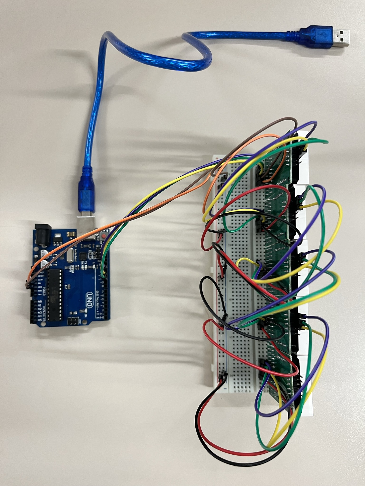

# Matriz Led ECA  

Autor: Jordi Rodríguez  
  
Control de 5 matrices Led en serie desde Arduino  
Utilizado para escribir mensajes en el departamento ECA de AG Mundet  
Para la programación usaremos la plataforma Arduino IDE:  

https://www.arduino.cc/en/software  

Se han incluido las siguientes librerías:  

- MD_MAX72xx
https://github.com/MajicDesigns/MD_MAX72XX  

Este código imprime el mensaje de texto de la linea 13 
  
  
  

## Material utilizado  

- 4 x MAX7219 = Matriz led 8x8   
- Protoboard  
- Arduino UNO  
  

## Pines de conexion  

A0 =  
A1 =  
A2 =  
A3 =   
A4 =  
A5 =  
D0 = (RX)  
D1 = (TX)  
D2 = (INT0)  
D3-= (INT1)  
D4 =     
D5-=  
D6-=  
D7 =  
D8 =  
D9-=  
D10-= CS pin  
D11-= Data pin  
D12 =   
D13 = CLK pin  
